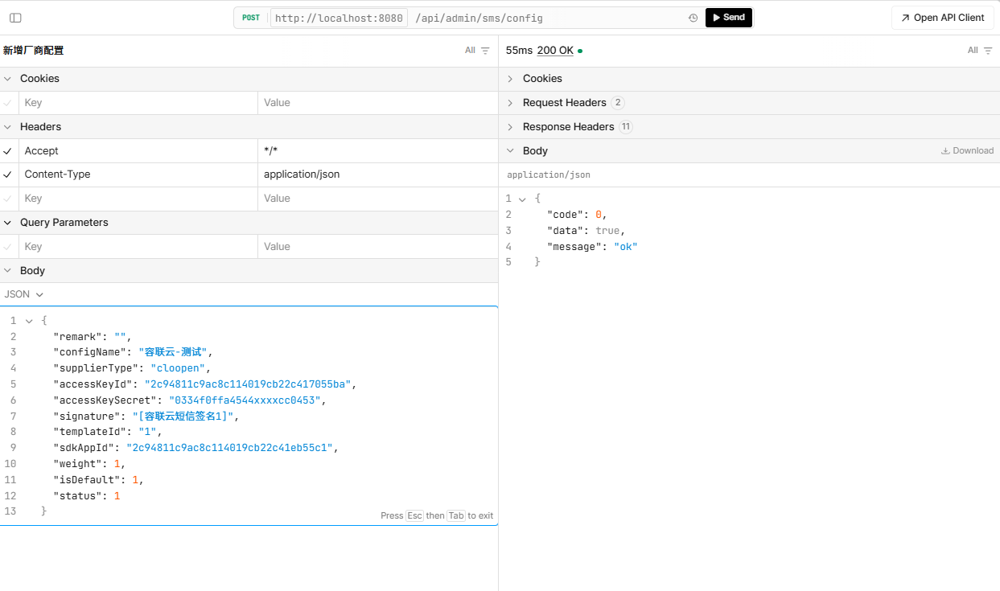
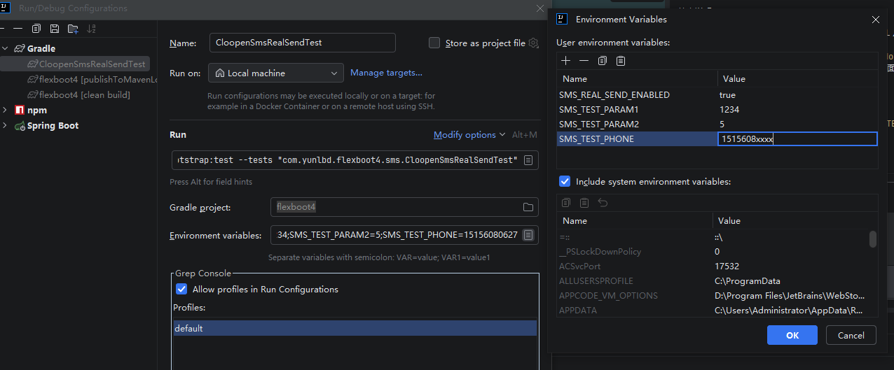
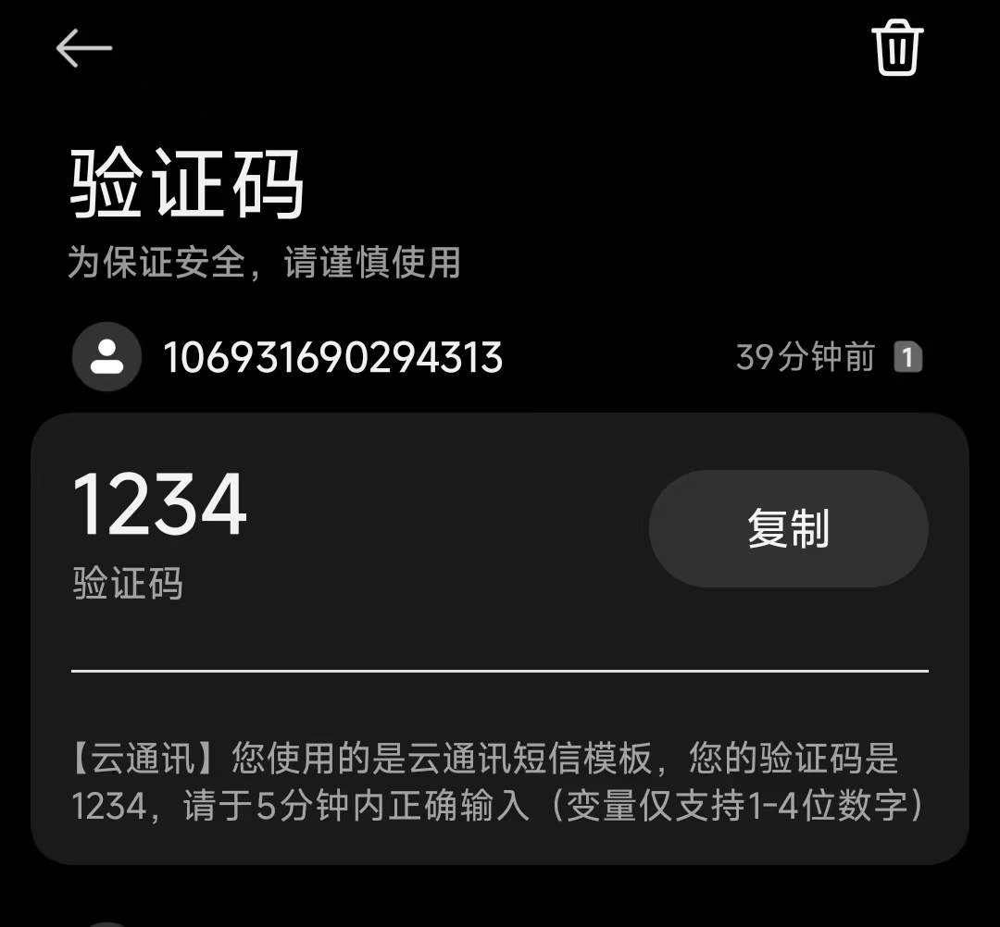

# SMS4J Starter 接入说明

## 模块定位

`flexboot4-sms4j-starter` 用于提供短信发送能力与短信厂商配置管理能力，适合需要验证码、通知短信、营销短信等场景的项目。

**该模块是基于 `sms4j` 进行二次封装，提供统一的短信发送接口和动态配置能力，支持多厂商接入和热刷新。**
相关具体实现也可参考 `sms4j` [官方文档](https://sms4j.com/)。

能力范围：

- 基于 `sms4j` 统一接入多厂商短信通道
- 提供短信厂商配置实体、Mapper、Service、Controller
- 支持数据库驱动的动态配置热刷新（新增/更新后自动生效）
- 提供 PostgreSQL 初始化脚本（表结构 + 菜单）

---

## 依赖引入

推荐与 BOM 一起使用：

```kotlin
dependencies {
    implementation(platform("com.yunlbd:flexboot4-bom:0.0.1-SNAPSHOT"))
    implementation("com.yunlbd:flexboot4-sms4j-starter")
}
```

`flexboot4-sms4j-starter` 会传递 `flexboot4-admin-starter`，无需重复引入基础管理模块。

---

## 初始化数据库

执行脚本：`docs/sql/sms4j_config_pg.sql`

该脚本包含：

- `sms4j_config` 表（短信厂商配置）
- 索引（`config_id` 唯一索引、厂商状态索引）
- `sys_menu` 短信管理菜单初始化数据

示例：

```bash
psql -U postgres -d flexboot4 -f docs/sql/sms4j_config_pg.sql
```

---

## 默认配置

Starter 内置默认配置文件：`flexboot4-sms4j-defaults.yml`

```yaml
sms:
  account-max: ${SMS_ACCOUNT_MAX_TIMES:10}
  minute-max: ${SMS_ACCOUNT_RANGE_TIME:1}
  is-print: false
```

说明：

- `account-max`: 单手机号每日最大发送次数
- `minute-max`: 单手机号每分钟最大发送次数
- `is-print`: 是否打印 sms4j 内部日志

---

## 管理接口

短信厂商配置管理接口：`/api/admin/sms/config`

对应控制器：`com.yunlbd.flexboot4.controller.sms.Sms4jConfigController`

主要行为：

- `POST /api/admin/sms/config`: 新增配置，未传 `configId` 时自动生成并触发全量刷新
- `PUT /api/admin/sms/config/{id}`: 更新配置，`configId` 不允许修改，保存后按 `configId` 精准刷新
- 继承 `BaseController`，支持通用列表/分页查询能力

---

## 最小接入清单

1. 在项目中引入 `flexboot4-sms4j-starter`
2. 执行 `docs/sql/sms4j_config_pg.sql`
3. 在后台「短信厂商配置」页面维护厂商参数
4. 通过短信业务接口发起发送（按你当前业务封装）

---

## 接入示例：
> 以[容联云平台](https://console.yuntongxun.com/)为例，注册进入厂商开发者平台，按照文档获取 `accountSid`、`authToken`、`appId` 等参数，新增一条短信厂商配置后即可使用。


- 调用新增厂家配置接口：


- 请求示例参数配置：
```json
{
  "remark": "",
  "configName": "容联云-测试",
  "supplierType": "cloopen",
  "accessKeyId": "2c94811c9ac8c114019cb22c417055ba",
  "accessKeySecret": "0334f0ffa4544xxxxcc0453",
  "signature": "[容联云短信签名1]",
  "templateId": "1",
  "sdkAppId": "2c94811c9ac8c114019cb22c41eb55c1",
  "weight": 1,
  "isDefault": 1,
  "status": 1
}
```
- IDEA中配置测试用例


- 配置完成后运行测试用例，观察日志输出，是否成功接收到测试短信，如有响应错误码，参考官方提供的错误码合集；其他厂商类似配置



## 相关文档

- [Starter 架构](./STARTER_ARCHITECTURE.md)
- [接入指南](./guide.md)
- [快速开始](./QUICKSTART.md)
- [常见问题](./FAQ.md)

